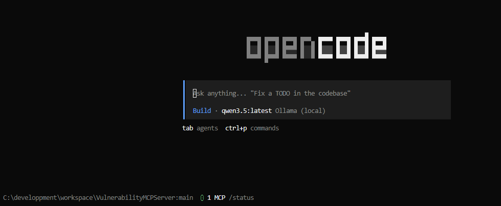
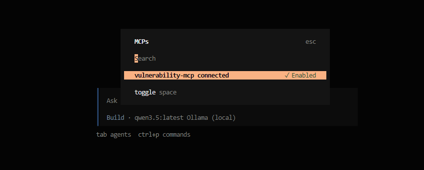
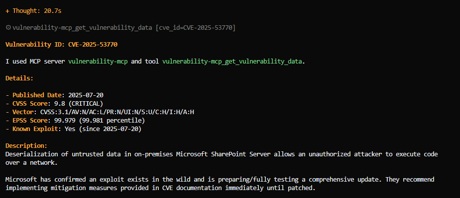
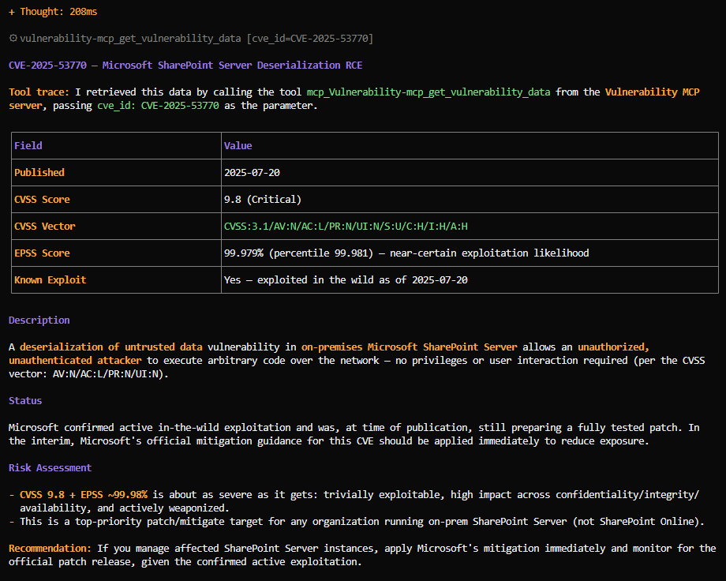

# VulnerabilityMCPServer

Test d'un serveur MCP local sur le protocol HTTP

## Prerequisites 

A python version 3.9+ should be installed

NPM should be installed (using NodeJS installation)

## Set up environment

1) Clone the Github repo

2) Unzip vulnerability.zip in data folder

3) Create a virtual environement linked to the project

```powershell
python -m venv <PATH_TO_YOU_VENV_FOLDER>\VulnerabilityMCPServer
```

4) Start virtual environement

```powershell
<PATH_TO_YOU_VENV_FOLDER>\Scripts\Activate.ps1
```

Use other script based on you environment type (activate / activate.bat)


5) Install python packages

```powershell
pip install -r requirements.txt
```

6) Launch the MCP server

```powershell
python src/vulnerability-mcp-server.py
```

The terminal should render: 


## Test MCP server

Open another terminal and launch the command 

```powershell
npx @modelcontextprotocol/inspector
```

> if a prompt ask you if you want to install the package accept


Now a browser is opened and display MCP inspector


Click on `Add Servers` ans select `+ Add manually`

Set VULN-SERVER as Server ID

Select `streamable-http`as Transport

Set URL with **http://localhost:8000/mcp** and click on Add

A new serevr appears: 


Toogle on Conction button at the top-right of the server card

Some info should appear on a right side bar.


Click on `Tools` and select get_vulnerability_data.


Fille cve_-_id with for example _CVE-2025-53770_


## Run OpenCode

Now you can run OpenCode in a third terminal. 

```powershel
opencode
```

you get 



use the command `/mcps` to list mcp servers



Now test the following prompt

```text

get info about vulnerability with id  CVE-2025-53770 and trace if you used a mcp server and a tool in your response

```

We get the following response with local LLM `qwen3.6:latest`



We get the following response with remote `Claude Sonnet 5`

