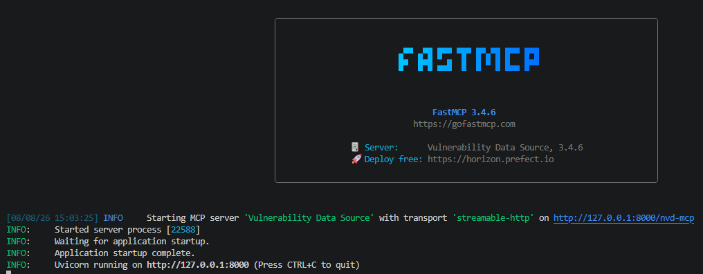
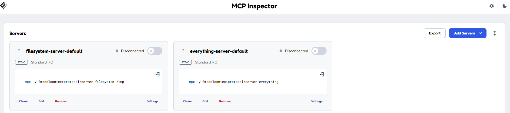
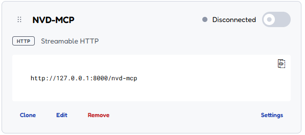
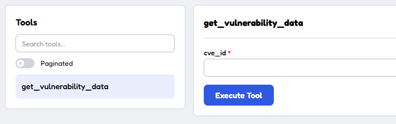
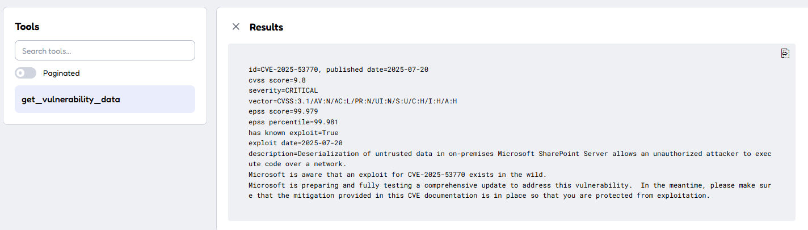

# `vuln-server` - Vulnerability Data Source server CLI

`vuln-server` launches the vulnerability data source, exposed either over
the **MCP protocol** (`streamable-http` transport) or as a plain **REST/JSON
API**, from the same codebase and the same local SQLite database (built
beforehand with `vuln-db`, see [`docs/vuln-db.md`](vuln-db.md)).

Both exposition layers (`src/vulnerability-mcp-server.py` for MCP,
`src/rest_api.py` for REST) call into the same business logic
(`src/tools/vulnerability_service.py`), so behaviour is identical between
modes - only the transport/protocol changes.

Always run it from the repo root (the JSON config files below are resolved
relative to the current working directory).

## Choosing a mode

```powershell
vuln-server --mode mcp     # MCP protocol, streamable-http (default)
vuln-server --mode rest    # REST/JSON API
```

## Configuration

Configuration (host/port/path/log level) is unified between the two modes:
each mode reads its defaults from a JSON config file with the same
`deployment` shape, itself overridable by CLI flags:

```
CLI flag  >  JSON config file (per mode)  >  built-in default
```

| Mode | Default config file |
| --- | --- |
| `mcp` | `fastmcp.json` |
| `rest` | `rest.json` |

`fastmcp.json`:

```json
{
  "$schema": "https://gofastmcp.com/public/schemas/fastmcp.json/v1.json",
  "source": {
    "path": "src/vulnerability-mcp-server.py",
    "entrypoint": "mcp"
  },
  "deployment": {
    "transport": "streamable-http",
    "host": "127.0.0.1",
    "port": 8001,
    "path": "/nvd-mcp",
    "log_level": "INFO"
  }
}
```

`rest.json`:

```json
{
  "deployment": {
    "host": "127.0.0.1",
    "port": 8080,
    "log_level": "INFO"
  }
}
```

### Flags

| Flag | Default | Description |
| --- | --- | --- |
| `-m`, `--mode` | `mcp` | Exposition mode: `mcp` or `rest`. |
| `-c`, `--config` | `fastmcp.json` (mcp) / `rest.json` (rest) | Path to the JSON config file to read for the selected mode. |
| `--host` | from config file, else `127.0.0.1` | Host/interface to bind to. |
| `--port` | from config file, else `8001` (mcp) / `8080` (rest) | TCP port to bind to. |
| `--path` | from config file, else `/nvd-mcp` (mcp) / root (rest) | URL path/prefix all routes are mounted under. In `rest` mode this prefixes every route, e.g. `--path api` -> `/api/health`, `/api/cves/{cve_id}`, etc. (the auto-generated `/docs`, `/redoc`, `/openapi.json` are not affected and always stay at the app root). |
| `--log-level` | from config file, else `INFO` | Log level. |

### Examples

```powershell
# Use the defaults from fastmcp.json
vuln-server --mode mcp

# Use the defaults from rest.json
vuln-server --mode rest

# Override just the port, keep everything else from rest.json
vuln-server --mode rest --port 9000

# Point to an alternate config file (e.g. per environment)
vuln-server --mode rest --config rest.staging.json

# Override host/port directly, ignoring config files entirely
vuln-server --mode rest --host 0.0.0.0 --port 9000 --log-level DEBUG

# Mount every REST route under a prefix, e.g. behind a reverse proxy at /api
vuln-server --mode rest --path api    # -> http://host:port/api/health, /api/cves/{cve_id}, ...
```

The terminal should render something like:




## Test the MCP mode

Start the server:

```powershell
vuln-server --mode mcp
```

Open another terminal and launch the MCP inspector:

```powershell
npx @modelcontextprotocol/inspector
```

> if a prompt asks you if you want to install the package, accept

A browser opens and displays the MCP inspector:



Click on `Add Servers` and select `+ Add manually`

Set `NVD-MCP` as Server ID

Select `streamable-http` as Transport

Set URL with **http://127.0.0.1:8001/nvd-mcp** (adapt host/port/path to your
config) and click on Add

A new server appears:



Toggle on the Connection button at the top-right of the server card. Some
info should appear on a right side bar.

Click on `Tools` and select `get_cve_by_id`.



Fill `cve_id` with for example _CVE-2025-53770_



### Available MCP tools

All tools are 100% local at query time (they read from `data/vulnerability.db`,
no outbound network calls, no API key required):

| Tool | Description |
| --- | --- |
| `get_cve_by_id(cve_id)` | Full detail for one CVE, formatted as text. |
| `batch_search_cves(cve_ids)` | Same as `get_cve_by_id` but for a batch of CVE ids, returning raw fields per id (plus a `found` flag for ids missing locally). |
| `search_cves_by_keyword(keyword, limit=50)` | Substring search over CVE descriptions, ordered by CVSS score (descending). |
| `get_epss_score(cve_ids)` | EPSS score/percentile (raw 0-1 fractions) for a list of CVE ids. |
| `check_kev_status(cve_ids)` | Whether each CVE id is listed in the CISA KEV catalog (boolean membership only). |
| `get_nvd_sync_status()` | Freshness of the local NVD-derived data, to help decide if a DB refresh is needed. |
| `search_cves_by_cpe(cpe, limit=50)` | CVEs affecting a given CPE 2.3 string (full or partial, e.g. `cpe:2.3:a:apache:log4j:2.14.1` or just `cpe:2.3:a:apache:log4j`). |
| `resolve_cpe(keyword, limit=50)` | Keyword search (vendor/product/title) against the CPE dictionary, e.g. to find the exact CPE name for a product before calling `search_cves_by_cpe`. Requires `vuln-db --init` to have been run. |

See `AGENTS.md` for the full details of each tool (return shapes, match
precision semantics, etc.).


## Test the REST mode

Start the server:

```powershell
vuln-server --mode rest
```

Interactive Swagger docs are available at **http://127.0.0.1:8080/docs**
(generated automatically by FastAPI, adapt host/port to your config), or
query the endpoints directly:

```powershell
Invoke-RestMethod -Uri "http://127.0.0.1:8080/cves/CVE-2025-53770"
```

By default routes are mounted at the root (as above). If `--path`/`rest.json`'s
`path` is set (e.g. `--path api`), every route below is prefixed accordingly
(`/api/cves/CVE-2025-53770`, `/api/health`, ...) - except `/docs`, `/redoc`
and `/openapi.json`, which always stay at the app root regardless of prefix.

### Available REST routes

| Method | Route | Equivalent MCP tool |
| --- | --- | --- |
| `GET /health` | Liveness check. | - |
| `GET /cves/{cve_id}` | Full detail for one CVE (JSON), 404 if not found. | `get_cve_by_id` |
| `POST /cves/batch` (body: `{cve_ids: [...]}`) | Full CVE detail for a batch of CVE ids. | `batch_search_cves` |
| `GET /cves/search?keyword=&limit=` | Substring search over CVE descriptions. | `search_cves_by_keyword` |
| `POST /epss-scores` (body: `{cve_ids: [...]}`) | EPSS score/percentile for a list of CVE ids. | `get_epss_score` |
| `POST /kev-status` (body: `{cve_ids: [...]}`) | CISA KEV membership for a list of CVE ids. | `check_kev_status` |
| `GET /nvd-sync-status` | Freshness of the local NVD-derived data. | `get_nvd_sync_status` |
| `GET /cves/search-by-cpe?cpe=&limit=` | CVEs affecting a given CPE 2.3 string. | `search_cves_by_cpe` |
| `GET /cpe/resolve?keyword=&limit=` | Keyword search against the CPE dictionary. | `resolve_cpe` |
